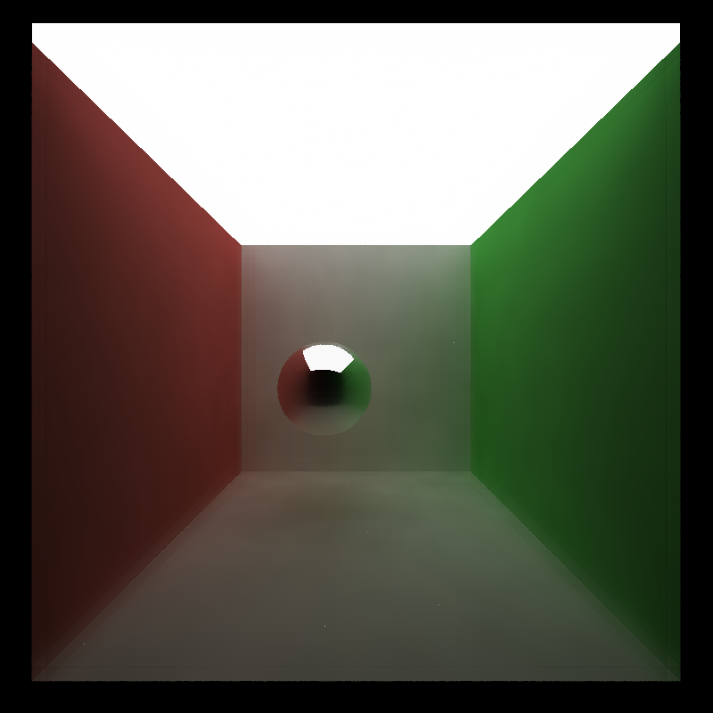

CUDA Denoiser For CUDA Path Tracer
==================================

**University of Pennsylvania, CIS 565: GPU Programming and Architecture, Project 4**

* Xitong Zheng
  * [LinkedIn](https://www.linkedin.com/in/xitong-zheng-5b6543205/), [Instagram](https://www.instagram.com/simonz_zheng/), etc.
* Tested on: Windows 11, i7-12700k 32GB, GTX 4090 24GB

## Brief Intro
This project focuses on implementing CUDA denoiser from the paper [Edge-Avoiding À-Trous Wavelet Transform for fast Global
Illumination Filtering](https://jo.dreggn.org/home/2010_atrous.pdf)

### Details
| raw | denoised |
|-----| -----    |
| |  |

### À-Trous Wavelet Filter
It approximates gaussian filter by iteratively applying sparse blurs of increasing size (stride size *= 2). It uses a small filter which spaces out the samples going through it, achieving far less read per pixels compared to gaussian filter when blur size increases. As for the À-Trous Wavelet Filter, increasing blur size means more iterations instead of larger filter size.
 
The above picture shows that using a 5x5 filter to achieve 16x16 blur.

### G-buffer 
Edge-avoiding filtering is achieved by introducing a datadependent weighting function, which is related to weights calculated from the G-buffer that contains the normal and position data per-pixel.

Simple visualizations for the normal and position info of the G-buffer.

| Normal | Position |
|---|---|
|||