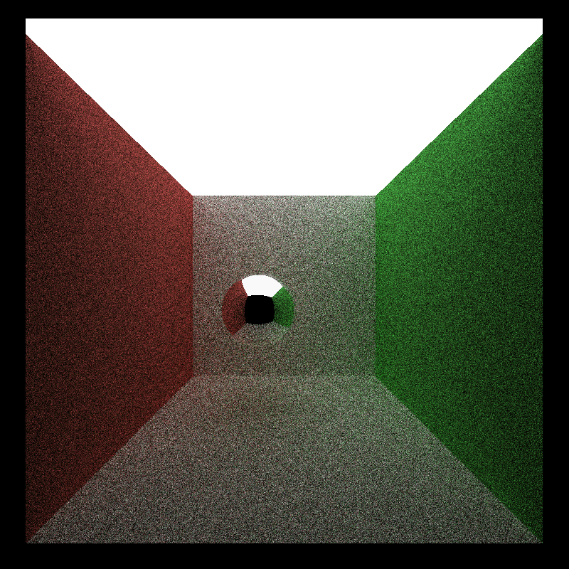

CUDA Denoiser For CUDA Path Tracer
==================================

**University of Pennsylvania, CIS 565: GPU Programming and Architecture, Project 4**

* Xitong Zheng
  * [LinkedIn](https://www.linkedin.com/in/xitong-zheng-5b6543205/), [Instagram](https://www.instagram.com/simonz_zheng/), etc.
* Tested on: Windows 11, i7-12700k 32GB, GTX 4090 24GB

## Brief Intro
This project focuses on implementing CUDA denoiser from the paper [Edge-Avoiding À-Trous Wavelet Transform for fast Global
Illumination Filtering](https://jo.dreggn.org/home/2010_atrous.pdf)

### Details
| raw | denoised |
|-----| -----    |
| |  |

### À-Trous Wavelet Filter
It approximates gaussian filter by iteratively applying sparse blurs of increasing size (stride size *= 2). It uses a small filter which spaces out the samples going through it, achieving far less read per pixels compared to gaussian filter when blur size increases. As for the À-Trous Wavelet Filter, increasing blur size means more iterations instead of larger filter size.
 
The above picture shows that using a 5x5 filter to achieve 16x16 blur.

Simply running a À-Trous Wavelet Filter serves as a gaussian filter.

| raw | À-Trous Wavelet Filter (no G-buffer)| Blur from GLSL |
|-----| ----- | ----- |
| |  | |

### G-buffer 
Edge-avoiding filtering is achieved by introducing a weighting function, which is related to weights calculated from the G-buffer that contains the normal and position data per-pixel. It diminshes the influence of neighboring samples that has far different values in G-buffers, making nice smoothing on planar surfaces and keeping the original edges.

Simple visualizations for the normal and position info of the G-buffer.

| Normal | Position |
|---|---|
|||

### Performance Analysis

#### How much time denoising adds to your renders?
when the denoiser is activated, I made denoiser run just after each time the call of pathtracer() finish.
Under resolution 800 * 800, the following two scenes are compared to see the denoising time impact.
| pathtracing (with no denoiser) | pathtracing (with denoiser) |
|---|---|
| 11.87(ms ) | 3.11(ms) |

It can be oberseved that the denoiser can add extra 3.11ms to the render time per frame.

#### How denoising influences the number of iterations needed to get an "acceptably smooth" result?

| Denoised Output with 10 spp | Output with 500 spp | reference output at 5000 spp |
|---|---|---|
||||

Denoising can achieve the same smoothness in image with far less render iterations. When looking at the denoisied image at 10 iterations, most of the noise can be removed except that there are some issues around the edge and shadow of the scene. But when we focus on the walls and the floor, the image quality is quite good. You can see 500 iterations of standard the pathtracer can achieve similar result. So the denoiser can save around  50x iterations to achieve similar result.

#### How denoising at different resolutions impacts runtime?
.png)
It can be observed that the denoiser runtime is linearly related to the resolution of the image. The denoiser runtime is around 6.8ms per frame at resolution 1600 * 1600, and it is around 26.5ms per frame at resolution 3200 * 3200.

#### How varying filter sizes affect performance?
.png)

It can be observed that denoiser time increases as filter size increase. The relation seems to be linear. This can be explained by when filter size is increased, more iterations are runned so that the 5x5 B3-spline kernel can be extended to the set filter size.

#### How visual results vary with filter size -- does the visual quality scale uniformly with filter size?

| 10 * 10 filter | 20 * 20 filter | 40 * 40 filter |  80 * 80 filter |
|---|---|---|---|
| |  |  |  |

The image quality improves significantly as the filter size increases from 10 * 10 to 40 * 40. But when the filter size is increased to 80 * 80, the image quality does not improve much. So the visual quality does not scale uniformly with filter size.

#### How effective/ineffective is this method with different material types?
The scene is run under 10 spp and 1600 * 1600 resolution. The following two scenes are compared to see the denoising effect on different material types.

| Matarial Type | Original  | Denoised |
|---|---|---|
| Diffuse |  |  |
| Specular |  |  |

It can be observed that the denoiser works more effective on diffuse material than specular material. The blurry effect on reflection is still visible after denoising.

#### How do results compare across different scenes - for example, between cornell.txt and cornell_ceiling_light.txt. Does one scene produce better denoised results? Why or why not?

| scene | Original | Denoised |
|---|---|---|
| cornell |  |  |
| cornell_ceiling_light |  |  |
| cornell_light_emittance = 1 |  |  |

It can be observed that the denoiser works better on the scene with more light source. The denoiser can remove the noise on the wall and the floor of the scene with more light source. This may because the default cornell scene under 10 spp is too much noiser than the scene with more light source. So the denoiser can not remove all the noise in the scene with less light source.

I further change the light emitance of the cornell scene to 1 and do not change the size of ceilling light. The denoiser can remove most the noise in the scene, which indirectly proves that the denoiser works better on the scene with less noisier input.

### Comparing A-trous and Gaussian filtering
The filter can be toggle between A-trous and Gaussian filtering by changing the macro `GAUSSIAN_FILTER` in pathtrace.cu.
Below scenes are all runned under 10 spp and 1600 * 1600 resolution.

| A-trous | Gaussian |
|---|---|
| |  |

You can see that the two picture do not vary a lot. But there are more noise on the white wall of Gaussian filtering and A-trous filtering is better. It may be because the A-trous filtering use G-buffer to achieve a more reasonable sparse sample.

| A-trous | Gaussian |
|---|---|
| 6.85ms | 139.71ms |

The runtime of A-trous filtering is far less than Gaussian filtering, nearly 20x faster. It can significantly increase the performance of the pathtracer than Gaussian filtering as the runtime of pathtracer without any filter is around 28ms.